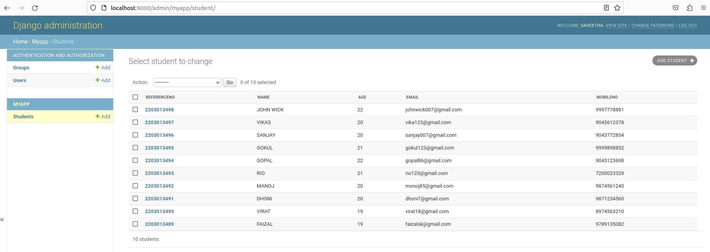

# Django ORM Web Application

## AIM
To develop a Django application to store and retrieve data from a database using Object Relational Mapping(ORM).

## Entity Relationship Diagram

Include your ER diagram here


## DESIGN STEPS

### STEP 1:
clone the repository here inside the folder ex02
### STEP 2:
After cloning the folder with the repository name django-orm-appwill be created.
### STEP 3:
Now move into the django-orm-appfolder then move into the folder myproj where manage.py file is located.
### STEP 4:
Now give the commands python3 manage.py startapp myapp to create myapp. Then change the necessary settings in the settings.py. 
### STEP 5:
Then enter the codes in models.py andd admin.py then give the commands:
python3 manage.py makemigrations
python3 manage.py migrate
### STEP 6:
Now  run the program using the command: python manage.py 
runserver 0:8000


## PROGRAM

Include your code 
```py
#FROM Admin.py
from django.contrib import admin
from .models import Student,StudentAdmin
# Register your models here.
admin.site.register(Student,StudentAdmin)
#FROM Models.py
from django.db import models
from django.contrib import admin

# Create your models here.
class Student (models.Model):
    referenceno=models.CharField(primary_key=True,max_length=20,help_text="referenceno")
    name=models.CharField(max_length=100)
    age=models.IntegerField()
    email=models.EmailField()
    mobileno=models.IntegerField()
class StudentAdmin (admin.ModelAdmin):
    list_display=('referenceno','name','age','email','mobileno')
```


## OUTPUT

Include the screenshot of your admin page.




## RESULT
We have succesfully created 10 students user as a superuser.
